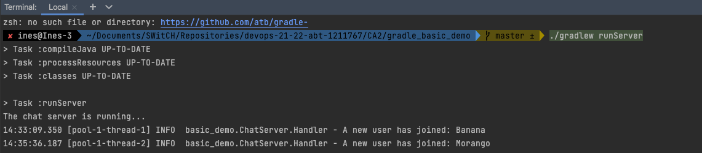
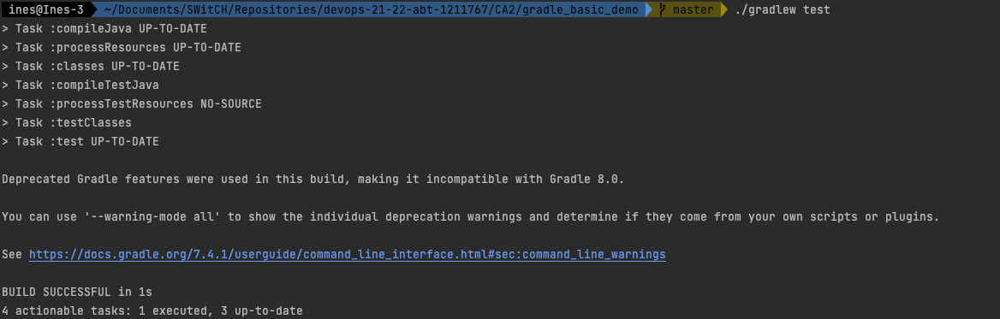
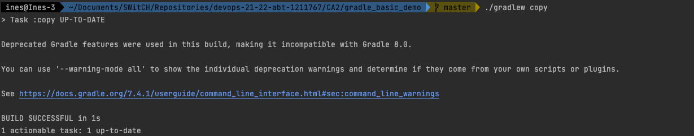
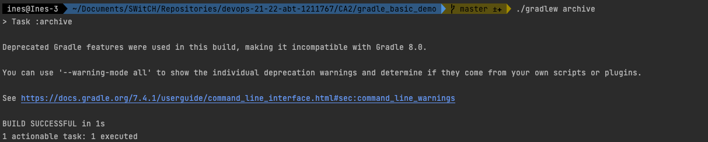

# Class Assignment 2

**Name:** Inês Lourenço Martins

**Discipline:** DEVOPS

**Date:** 28 March - 11 April

----------------------------------------------------------------------

### Description

This assignment has the main purpose of integrating students' knowledge with Gradle which is the latest and most flexible
build tool.

During this assignment and according to previous indications, the learning goals to attain are:

- First Week
    - create tasks
    - run tasks

- Second Week
   - create from scratch a gradle project
   - analysis and implementation of an alternative (maven)

--- 

# 1. Analysis

## Part 1:
According to gradle_basic_demo README.md file, the three run commands initializes the chat application:

*[transcription]*

***Build*** *To build a .jar file with the application:*

    % ./gradlew build

***Run the server*** *Open a terminal and execute the following command from the project's root directory:*

    % java -cp build/libs/basic_demo-0.1.0.jar basic_demo.ChatServerApp <server port>

*Substitute by a valid por number, e.g. 59001*

***Run a client*** *Open another terminal and execute the following gradle task from the project's root directory:*

    % ./gradlew runClient

This first topic made us to understand that we can automate tasks incorporated in the building process. So, instead of
running that whole script, we can simply run it in a few words

      $ ./gradlew runServer

*[end of transcription]*

During this first part, the main concepts were introduced, so the students could be more confortable in managing the build tool.
The exercise allowed us to know how to create tasks and manipulating them more easily. Instead of having a whole line 
of code to run the Server, we created a task "runServer". The same was done regarding running tests, creating a backup and zipping the src folder.
The implementation can be seen in the following chapters.

# 2. Design

## Part 1

This assignment was composed by four topics:

### 2.1. Create a task to Run the Server:

### 2.2. Create tests and run it as a task

### 2.3. Create a task "copy" to create a backup

### 2.4. Create a task "archive" to create a zip file

# 3. Implementation

## Part 1

### 3.1. Create a new Task to Run the server

Go to 'build.grade'

1. Add the following code to pluggin features:

        //Apply java plugin tasks for enhace and run the project
        id 'java'        

2. Create new task 'runServer'

       task runServer(type:JavaExec, dependsOn: classes){
           group = "DevOps"
           description = "Initializes the server in port :59001"

           classpath = sourceSets.main.runtimeClasspath
           main = 'basic_demo.ChatServerApp'
           args '59001'
       }

3. Run the server in the terminal with the task name to test:

        ./gradlew runServer  

### 3.2. Create a task to Run Tests

1. Create a test java file

Go to 'build.gradle'

2. Add the following code to dependencies features:

       // Use JUnit for testing
       implementation 'junit:junit:4.12'

3. Run test in the terminal:

       $ ./gradlew test

### 3.3. Create a task "Copy" to create a backup

Go to build.gradle

1. Add the following code as a new task:

         task copy(type: Copy){
           from 'src/'
           into 'backup'
         }

By running this task, gradle build a new folder called "backup" from main file "src".

2. Run task copy in the terminal:

         $ ./gradlew copy

### 3.4. Create a task "Zip" to create a zip file

Go to build.gradle

1. Add the following code as a new task:

         task archive(type: Zip){
         from 'src/' 
         archiveFileName = 'srcArchive.zip' 
         destinationDir(file(rootDir))
         }

2. Run task archive in te terminal:
      
         $ ./gradlew archive

