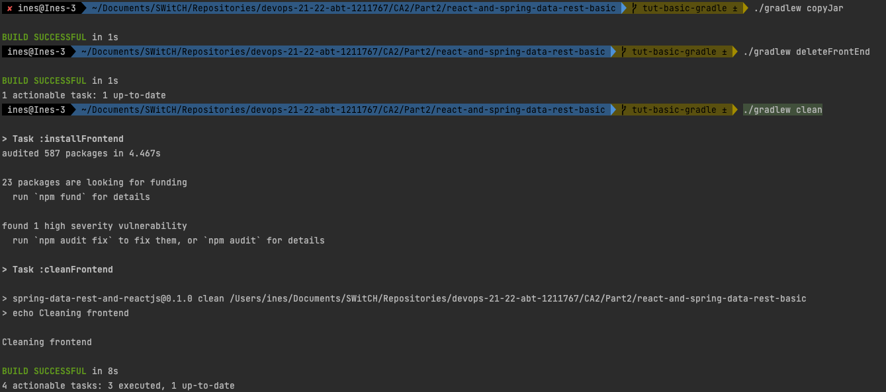
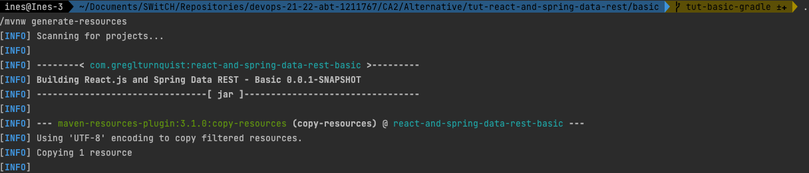
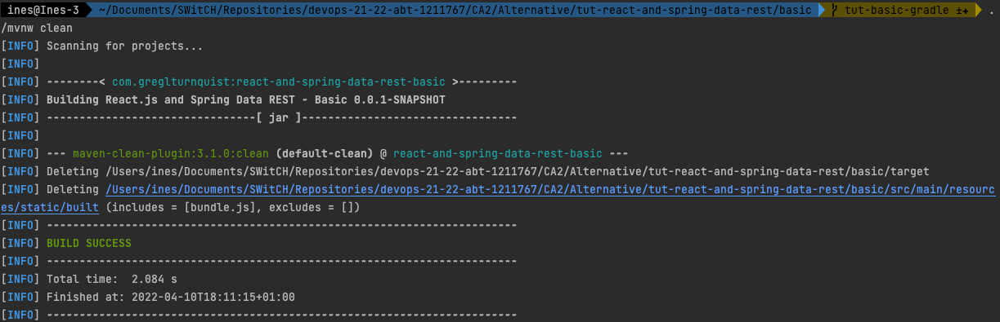

# Class Assignment 2 - Part 2

**Name:** Inês Lourenço Martins

**Discipline:** DEVOPS

**Date:** 28 March - 11 April

----------------------------------------------------------------------

### Description

his assignment has the main purpose of integrating students' knowledge with Gradle which is the latest and most flexible
build tool.

During this assignment and according to previous indications, the learning goals to attain are:

- First Week
    - create tasks
    - run tasks

- Second Week
   - create from scratch a gradle project
   - analysis and implementation of an alternative (maven)

--- 

# 1. Analysis

## Part 2:

To implement this part, we created a new branch, so we could later merge all changes in the repository
This branch is called tut-basic-gradle and allowed us to add a new folder called "Part2".

- **Create a new Gradle Project**
    - Go to https://start.spring.io and set up all customizations with dependencies
- **Copy src folder from CA1 assignment (basic) and paste to this tutorial**
    - Delete 'built' folder (in resources/static)
    - copy files webpack.config.js and package.json
    
To implement this part, we created a new branch, so we could later merge all changes in the repository
This branch is called tut-basic-gradle and allowed us to add a new folder called "Part2".

By creating a Gradle build file, we could configure and customize it to our needs, including dependencies. 
After this point, we copied the src code folder from our CA1, add also js and jason files, so the frontend could be built.
This is only possible having org.siouan.frontend plugin, so we'll have to add it to gradle.build along its configuration and 
scripts.

Now we have to create these tasks:
- copy .jar files to "dist" folder
- clean all the files generated by webpack

They are described in the topics bellow.

---

## Alternative:

The alternative here proposed was maven, since it was the most commonly used build tool before gradle. Since
our main project is developed under the build of maven, it allowed us to understand the use of it, its lifecycles and syntax.
To do so, we applied the same achieving goals:
- **Create a Maven Project from CA1**
    - Delete 'built' folder (in resources/static)
    - copy files webpack.config.js and package.json
    
Instead of build.gradle here, we have POM (short name for Project Object Model), stores all information about the project.
POM defines the project with "coordinates", which are <groupId>, <artifactId> and <version>. Then we add the project's dependecies
that are required to project to work.

Maven works as a term of lifecycles (as the steps to build the project). There are multiple Lifecycles, but the most used ones 
during a project build are: 
- Validate
- Compile
- Test
- Package
- Verify
- Install
- Deploy

When using these commands, they "execute each default lifecycle phase in order"(source: Maven documentation present in 
maven.apache.org/guides/introduction/introduction-to-the-lifecycle.html). 

The most similar that we have to Tasks in Gradle are defined as plugins. These plugins are incorporated in POM and unlike Gradle,
they cannot be freely written, on the contrary: there is a defined list of plugins in Maven documentation (maven.apache.org/scm.html).
From this source, we can add plugins to our project according to our needs. 

As we will see later in our last topic, we created the "tasks" with maven plugins described in our POM:
- copy .jar files from target to folder 'dist';
- clean files generated from our frontend files (webpack.config.js)

###Comparison between Gradle and Maven 

| Aspects       | Gradle                                                                                                                                                 | Maven                                                                                                                                                                |
|---------------|--------------------------------------------------------------------------------------------------------------------------------------------------------|----------------------------------------------------------------------------------------------------------------------------------------------------------------------|
| Build time    | Gradle performs incremential build. This means that if the task did not changed  it won't run it again. So speeds ups the process                 | Everytime we build the project, the tasks are performed all over again, regardless they  have or not changed.                                                    |
| Script Syntax | gradle.build is developed in groovy, an easy and readable language inspired in java.  Its dependecies are described in one line, avoiding verbose.  | POM is written in a XML file with XML tags, which is similar to HTML.  It contains tags and might be a bit dificult to read                                      |
| Tasks         | Gradle allows "Custom Tasks" which are customizable tasks that the developer can write.  Easies up the process and adds flexibility to it          | All tasks are added as "plugins". As developers, we cannot write it them out as we wish.  Instead, we must search for developed plugins and add them to POM file |

---

# 2. Design

## PART 2

## Alternative

___

# 3. Implementation

## Part 2

In this part, the motivation wsa to create a gradle project from scratch and then add the code from the CA1 example (src folder and
frontend configurations: webpack.config.js and package.json).

The frontend configurations allow gradle to build the files, meanwhile the gradle.build must have the proper plugins to be able to do it.
So, we added the https://github.com/Siouan/frontend-gradle-plugin that gathers all necessary tools to build Node.ja, npm, Yarn Berry, Yarn Classic,
just as this program requires. Up to this point, we need to address these configurations on the build, pasting the following code
in the gradle.build document:

    frontend {
    nodeVersion = "14.17.3" 
    assembleScript = "run build" 
    cleanScript = "run clean" checkScript = "run check"
    }

and the following in the package.json:

    "scripts": {
    "webpack": "webpack",
    "build": "npm run webpack",
    "check": "echo Checking frontend",
    "clean": "echo Cleaning frontend",
    "lint": "echo Linting frontend",
    "test": "echo Testing frontend"
    },

Then, we created the requested tasks:

*copy jar file and store it in folder 'dist':*

    task copyJar(type: Copy){
    from 'build/libs/'
    into 'dist/'
    println 'Jar files archived in folder dist'
    }

*create task to delete all the files generated by webpack*

    task deleteFrontEnd (type: Delete){
	delete('src/resources/main/static/built/')
	println 'FrontEnd files deleted'
    }

*create task to execute before task clean*

    clean{
        doFirst {
            deleteFrontEnd
        }
    }

Concluding, the application is executed and its build is successfully achieved.

---
## Alternative

To Maven project,developing these two tasks required us to add two types of plugins. In maven Apache website, the resources
to add plugins are quite a few.

As previously mentioned, maven lifecycle are sequential. Both tasks are run before install phase.

*Copy jar files*

            <plugin>
				<artifactId>maven-resources-plugin</artifactId>
				<version>3.1.0</version>
				<executions>
					<execution>
						<id>copy-resources</id>
						<!-- here the phase you need -->
						<phase>generate-sources</phase>
						<goals>
							<goal>copy-resources</goal>
						</goals>
						<configuration>
							<outputDirectory>dist</outputDirectory>
							<resources>
								<resource>
									<directory>target/</directory>
									<include>*.jar</include>
								</resource>
							</resources>
						</configuration>
					</execution>
				</executions>
			</plugin>

Since this plugin is run in generate-resources phase, we can just run the following command to create the folder dist

        ./mvnw generate-resources 

*Clean files generated by webpack*

    
            <plugin>
				<artifactId>maven-clean-plugin</artifactId>
				<version>3.1.0</version>
				<configuration>
					<filesets>
						<fileset>
							<directory>src/main/resources/static/built</directory>
							<includes>
								<include>bundle.js</include>
							</includes>
						</fileset>
					</filesets>
				</configuration>
			</plugin>

This is a special plugin beacuse it's "is bound to its own special lifecycyle phase called clean" (source: maven.apache.org/plugins/maven-clean-plugin/usage.html)
So, to run it we just need to make use of the following command:

            ./mvnw clean

Concluding, the application is executed and its build is successfully achieved.
