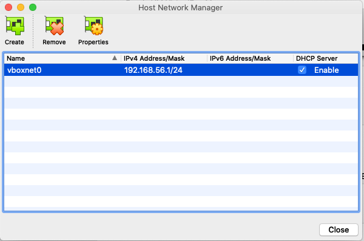
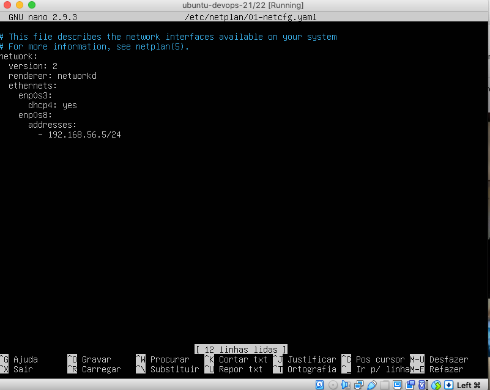
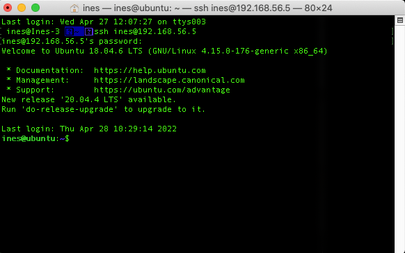
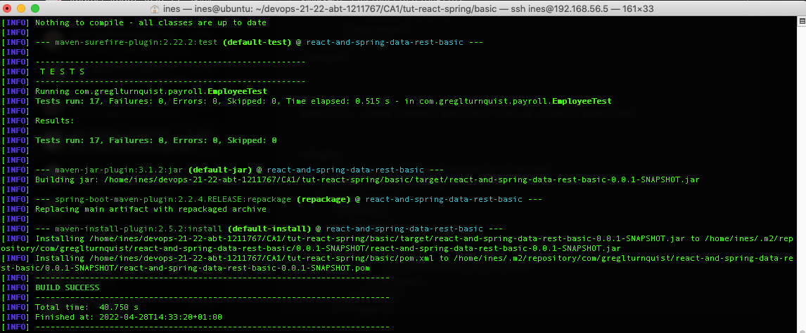
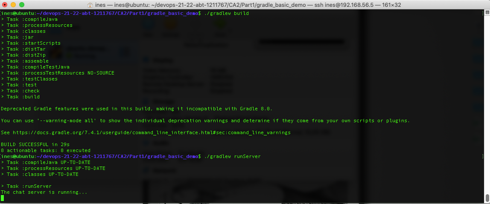

# Class Assignment 3

**Name:** Inês Lourenço Martins

**Discipline:** DEVOPS

**Date:** 19 April - 9 May

----------------------------------------------------------------------

### Description

This assignment has the purpose to manipulate Virtual Machines.

During this assignment and according to previous indications, the learning goals to attain are:

- First Week:
  - Mapipulate a new Ubuntu VM through Virtual Box
  
- Second Week:
  - Virtualization with Vagrant

--- 

# Analysis, Design and Implementation - Part 1

## Analysis:
It's important to set up the system, so we can develop and deliver this assignment. The following points describes
the steps taken:

1. Instal VirtalBox: this software is called Hypervisor. It let operate in the (local) host multiple 
Virtual Machines (called Guests).

2. Create a Guest OS : Ubuntu 18.04 minimal installation media
   1. this means that the OS won't have any GUI; we'll solenly use the terminal to make our changes

3. Set the Network Adapter has a Host-Only Adapter 
   - This enablement will allow our new VM to connect with the host through IP 192.168.56.1/24. This IP in particular
grants the access to our local network, which means that establishes the connection only with points connected in this address.
   - As we'll later, in the next topic there was a challenge while doing this topic.

### Challenges and struggles during the process

1. MacOS as a set of security measures that does not allow to any software to easily change the security topis
2. Portic in FileZilla was imposing some security definitions, so instead of choosing a random port, I've taken the decision
of choosing port 21, by creating a safe connection. 
3. Our VM didn't install automatically the Gradle update (7.4.1);
   1. so we needed to give permissions to gradlew file to execute (chmod u+x gradlew)
   2. execute ./gradlew tasks (or other kind of tasks)
   3. from there the new version is downloaded, and we can sucessfully run and execute tasks
4. In order to run gradle_basic_demo task runServer, we needed to update the IP address, since our VM would be our server.
After this, the app is operable in our VM.

##Implementation

### SetUp part
**1. Install and use VirtualBox to create a VM**
   1. Create VM
   2. Change VM settings:
      1. Connect image (ISO) with the Ubuntu 18.04 minimal installation media: https: //help.ubuntu.com/community/ Installation/MinimalCD 
      2. Set Network Adapter 1 as Nat 
      3. Set Network Adapter 2 as Host-only Adapter (vboxnet0)
         1. main menu, select File -> Host Network Manager
         2. create a vboxnet0 whit IP 192.168.56.1/24

   

**2. Install setups needed in our new VM:**

   _A. Update the packages repositories_
`       sudo apt update`

   _B. Install the network tools:_
`      sudo apt install net-tools`

- Edit the network configuration file to setup the IP and add IP 192.168.56.5
`      sudo nano /etc/netplan/01-netcfg.yaml`
- Apply changes
`      sudo netplan apply`

   _C.Install openssh-server (so we can access to VMfrom other terminal sessions from other hosts)_
   `      sudo apt install openssh-server` 

- Enable password authentication for ssh:
      `   sudo nano /etc/ssh/sshd_config`

  - uncomment the line PasswordAuthentication yes 
        `      sudo service ssh restart`

_D. Install a ftp server so that we can use the FTP protocol to transfers files to/from the VM (from other hosts)_
     `   sudo apt install vsftpd`
- Enable password authentication for ssh:
`   sudo nano /etc/vsftpd.conf`   
   
   - uncomment the line write_enable=YES
`      sudo service vsftpd restart`

**3. Access through our host machine through a new terminal session by running this command:**

   `ssh ines@192.168.56.5`

- Install git
  `sudo apt install git`

- Install java
`sudo apt install openjdk-8-jdk-headless`

### Building and Execute our Repositories in our VM

**A. Clone individual repository inside the VM**

`git clone https://ineslourencom@bitbucket.org/ineslourencom/devops-21-22-abt-1211767.git
`

1. Install dependencies
   1. Maven:
`   sudo apt install maven`
   2. Default jdk (we had it already)
`   sudo apt install default-jdk
`   
   3. Gradle
      `   sudo apt install gradle`
    - when doing this, it's important to be updated, so we can run ./gradlew tasks successfully
(see point 3 in point "Challenges and struggles during the process")

2. spring boot tutorial basic project:

`./mvnw install`

`./mvnw spring-boot:run`

3. gradle_basic_demo project:

`   ./gradlew build`

`   ./gradlew runServer`

   

   

