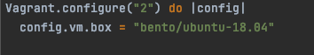
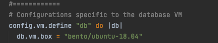
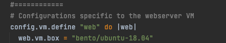
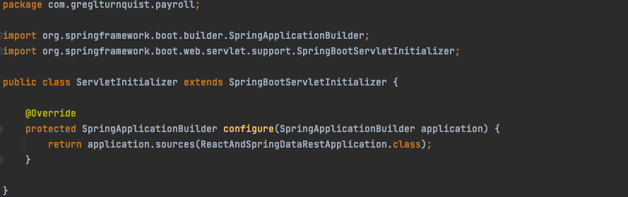
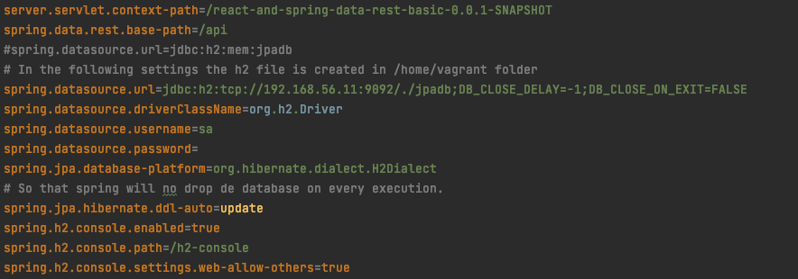
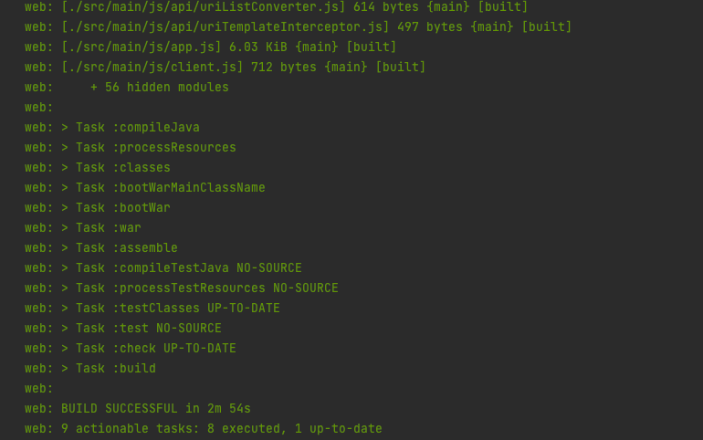
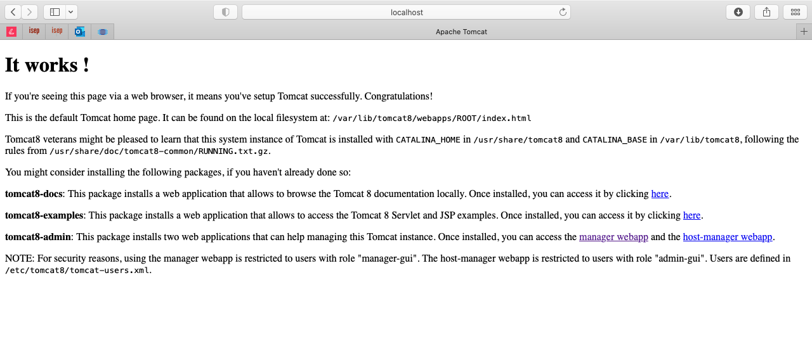
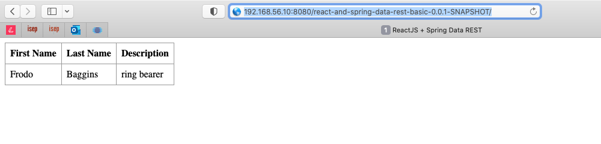

# Class Assignment 3

**Name:** Inês Lourenço Martins

**Discipline:** DEVOPS

**Date:** 19 April - 9 May

----------------------------------------------------------------------

### Description

This assignment has the purpose to manipulate Virtual Machines.

During this assignment and according to previous indications, the learning goals to attain are:

- First Week:
  - Mapipulate a new Ubuntu VM through Virtual Box
  
- Second Week:
  - Virtualization with Vagrant

--- 

# Analysis, Design and Implementation - Part 2

## 1. Analysis:
In this assignment, we use Vagrant as a tool to set up the Virtual Machine environment. 
Vagrant helps us to configure automatically the VM's, it's available with multiple Providers

To run Vagrant (which it doens't have a GUI), we must install it. Everytime we initialize a vagrant set up,
we can do it in two different ways:
- Add a Vagrantfile to our project
- Run `vagrant init <place the provider/box>`

In both ways we need a vagrantfile to start our work.

According to this class assignment indication, we must download the vagrantfile from https://bitbucket.org/atb/vagrant-multi-spring-tut-demo/
The file is already provisioned with two VM's:
- web: this VM is used to run tomcat and the spring boot basic application
- db: this VM is used to execute the H2 server database.

The implementation of the assignment is described in the next topic.

### Challenges and struggles during the process

1. Node.js incompatibility with other versions
2. 

##Implementation

### SetUp part
**1. Install Vagrant**

    brew install --cask vagrant

**2. Copy CA2/Part2/react-and-spring-data-rest-basic folder to our CA3/Part2**

    mkdir CA3/Part2
    sudo cp ./CA2/Part2/react-and-spring-data-rest-basic CA3/Part2/react-and-spring-data-rest-basic

**3. Change the Vagrantfile to adapt it to our Project**

   _A. Change the box for one that works with java 11_

In this case, we've changed to bento/ubuntu-18.04, which is available to several providers, such as VirtualBox, Parallels or VMware

   _B. Change the Java version to Java 11 in web VM:_

Due to incompatibilities between previous boxes and java versions
we needed to change to version 11 in our db VM

        sudo apt-get install openjdk-11-jdk-headless -y

    
_C. Change the repository in web VM:_

        git clone https://ineslourencom@bitbucket.org/ineslourencom/devops-21-22-atb-1211767.git

_D. Change cd in web VM:_

        cd devops-21-22-atb-1211767/CA3/Part2/react-and-spring-data-rest-basic

_E. Change our build.gradle file to incorporate version changes:_

1. incorporate the war plugin:
   
        plugins {
             (...)
             id 'war'
         }
    
2. add dependencies to support war files in tomcat 

        dependencies {
            (...)
           runtimeOnly 'com.h2database:h2'
            (...)
            // To support war file for deploying to tomcat
            providedRuntime 'org.springframework.boot:spring-boot-starter-tomcat'
        }

3. Change frontend build features

        frontend {
           nodeVersion = '12.13.1'
           assembleScript = 'run webpack'
        }

_F. Change package.json_

1. Add node script dependencies so our build doesn't fail

        "scripts": {
          "preinstall": "npx npm-force-resolutions",
         (...)
         }
In this case, this is where I struggled the most: my node couldn't be recognized while building the frontend.
So after some research, I've discovered this script that forces resolutions before every `npm install`

2. add scripts to run the webpack

         "scripts": {
           "watch": "webpack --watch -d",
           "webpack": "webpack"
         }

_G. Create servletInitializer.java_

This Servlet Initializer is "an extension of WebApplicationInitializer which runs a SpringApplication from a traditional WAR archive deployed on a web container."
(Source: https://www.baeldung.com/spring-boot-servlet-initializer). This class is important on building the war files, upgrading the application context. 

_H. Change application.properties_

These changes are related do db H2 database and the servlet context path

_I. Change paths related to war files_

1. app.js

    client({method: 'GET', path: 'react-and-spring-data-rest-basic-0.0.1-SNAPSHOT/api/employees'}).done(response => {

2. settings.gradle

    rootProject.name = 'react-and-spring-data-rest-basic'

##2. Design

      vagrant up --provider virtualbox

---

---

##3. Implementation

### Building and Execute in our VM

We must go to our folder and start our VM's

      cd devops-21-22-atb-1211767/CA3/Part2
      
      vagrant up --provider virtualbox

If it's not the first time in starting our VM, instead we must run this command:

      vagrant reload --provision

As we can see in the following images, our VM's are running as expected.

We can have access through the following links, after `vagrant up` command:

http://localhost:8080/react-and-spring-data-rest-basic-0.0.1-SNAPSHOT/

http://192.168.56.10:8080/react-and-spring-data-rest-basic-0.0.1-SNAPSHOT/

After loading the VM's, we must stop them, otherwise they'll continue to run. To
do that we must insert:

      vagrant halt

And the clean up:

      vagrant destroy –f

      vagrant box remove <name of the box>

----

   
# Alternative

After some trials with VMware Fusion, we couldn't be able to apply the same exercise.

## VMware Fusion

Originally, VMware worked ony with Linux and Windows through VMware Workstation. Then the upgrade came with Fusion,
allowing macOS work with this software

First, we need to install Vagrant-VmWare-desktop plugin. The Vagrant VMware Desktop plugin is the Vagrant plugin
which adds support for the vmware_desktop provider to Vagrant

      vagrant plugin install vagrant-vmware-desktop

Then, we apply the license

      vagrant plugin license vagrant-vmware-desktop ./license.lic

Besides this plugin, we must also add Vagrant VMware Utility, which "is a system installer package and is required by the Vagrant 
VMware Desktop plugin for proper functionality. This system installer provides a small utility service that Vagrant utilizes for interacting with VMware on the system."

      sudo mkdir -p /opt/vagrant-vmware-desktop/bin
      sudo unzip -d /opt/vagrant-vmware-desktop/bin vagrant-vmware-utility_1.0.0_linux_amd64.zip

Run the certificate

      sudo /opt/vagrant-vmware-desktop/bin/vagrant-vmware-utility certificate generate

Install the service 

      sudo /opt/vagrant-vmware-desktop/bin/vagrant-vmware-utility service install

Run the service 

      sudo launchctl load -w /Library/LaunchDaemons/com.vagrant.vagrant-vmware-utility.plist

Then, according to instructions and after changing the vagrantfile, we could initialize 
the VM while using the provider VMware by inserting

      vagrant box add bento/ubuntu-18.04

(option 3 - vmware)
      
      vagrant up --provider=vmware_desktop

Unfortunatelly, and after some emails with HashCorp, vmware desktop turned open source, and they
can no longer provide support to issues related to it. From what I could search, my macOS version
is unconfigurable with vmware desktop and vmware fusion.

## Analysis of the alternative

From my personal experience, I can say that Virtual Box is broadened in terms of different OS configuration. 
VMware was not designed for macOS, or at least older versions of the Operating System. Also, VirtualBox is a free open-source tool, and VMware isn't: we must
pay to attain the premium version (I used the free 30 days trial on trying to implement the exercise).

