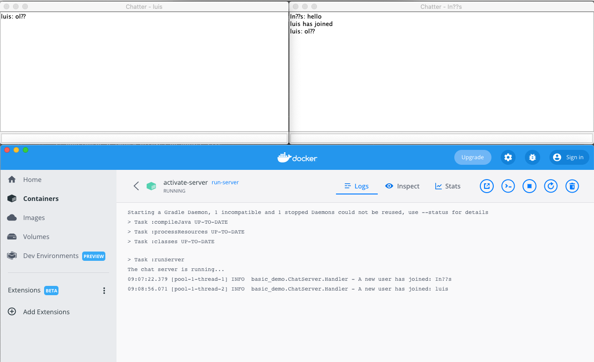
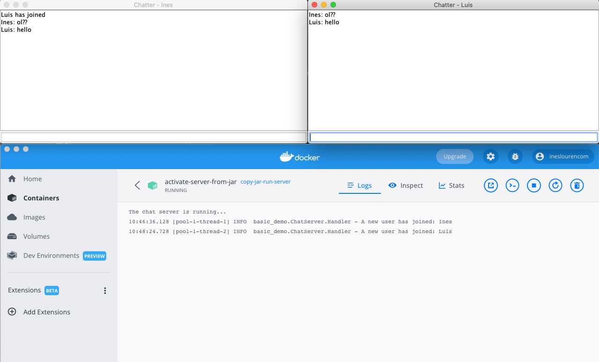

# Class Assignment 4

**Name:** Inês Lourenço Martins

**Discipline:** DEVOPS

**Date:** 9 May - 23 May

----------------------------------------------------------------------

### Description

This assignment has the purpose to manipulate Containers.

During this assignment and according to previous indications, the learning goals to attain are:

- First Week:
    - to practice with Docker, creating docker images and running containers using the chat application from CA2
    
  
--- 

# Analysis, Design and Implementation - Part 1

## Analysis

Docker offers a semi-closed system level when creating a Container. Unlike Virtual Machines, that offers a closed system, having a Hypervisor that
completely separates the host OS from the guest OS, and this last one simulates a completely different system. Due to this premisse, a container, when installed, must 
match to the same kernel family as the host OS. For example, we cannot deploy a Windows related container in a Linux host OS.

Due to this factor, when installing Docker Desktop and since my OS is macOS - from the same family as Unix-based operating system - Docker Desktop app does run a Linux host Virtual Machine 
in my macOS. This becomes quite interesting, because we can never have the same configurations universally and everything relies on virtualization and 
containerization when developing software for different systems.

Another interesting feature is the container is running along as the process within it is alive. The container exits soon as the process
is complete

This week assignment is composed in two parts:

- Part 1 - build the chat server "inside" the Dockerfile

- Part 2 - build the chat server in host computer and copy the jar
file "into" the Dockerfile1

### Usefull docker commands
Pull an image (we can do that without using it): 
      
    docker pull openjdk

Run a container:

    docker run <container-name>

Run a container while returning to our terminal:

    docker run -d <container-name>

List all running containers:

    docker ps

List all running or not running containers

    docker ps -a

Stop a container:

    docker stop <container's name>

Remove a container:

    docker rm <container's name>

List all images:

    docker images

Remove an image (we must ensure that no container is running with that image!!):

    docker rmi <image-name>

Commit and push an image to our repository:

       docker commit [Container id] [docker hub use]/[Container name]:[Tag]
       docker push [docker hub user]/[Container name]:[Tag]

## Design

Part 1 

___

Part 2

## Implementation

 **First Part - Build Chat Server from Dockerfile**

1. We need to create our Dockerfile inside the project we need. We've copied the project to CA4 - Part 1

            # syntax=docker/dockerfile:1
             FROM ubuntu

             RUN apt-get update
             RUN apt-get install -y apache2
             RUN apt-get clean && rm -rf /var/lib/apt/lists/*

             RUN apt-get update
             RUN apt-get install openjdk-8-jdk-headless -y
             RUN apt-get install git -y

             RUN git clone https://ineslourencom@bitbucket.org/ineslourencom/devops-21-22-atb-1211767.git
             WORKDIR devops-21-22-atb-1211767/CA4/Part1/gradle_basic_demo

             RUN chmod u+x gradlew

             RUN ./gradlew clean build

             EXPOSE 59001

             ENTRYPOINT ./gradlew runServer

Some important notes to take are related to the commands present in this file: just
exactly CA2, we're going to clone the project to our image, build the project (./gradlew clean build), expose it in the port 
59001, and finally run the task ./gradlew runServer, so we can use the server in ChatAppDemo.

This document exibits the guidelines on how the image will behave.

2. Create our image from our Dockerfile with name run-server:

        docker build --no-cache -t run-server .

   We can check if our image is runnign through the following command:

         docker images

4. Create our container from our image run-server

        docker run -p 59001:59001 -d --name activate-server run-server

   Now we can check if our container "activate-server" is running through the following command:

         docker ps -a

4. Create account in docker hub and login through our terminal:

         docker login

5. As requested in the assignment, we must tag the image and push in our docker hub account.
We can do that through the following commands

         docker commit 0615333010f1 ineslourencom/activate-server:v1
         
         docker push ineslourencom/activate-server:v1

6. Now we can see the result using the client part

            ./grandlew runClient

___

**Second Part - Build the chat server in host computer and copy the jar
file "into" the Dockerfile**

1. Create a new Dockerfile, so we can only use the jar file

         FROM ubuntu

         RUN apt-get update -y
         RUN apt-get install -y openjdk-11-jdk-headless

         COPY basic_demo-0.1.0.jar basic_demo-0.1.0.jar

         EXPOSE 59001

         ENTRYPOINT java -cp basic_demo-0.1.0.jar basic_demo.ChatServerApp 59001

2. Create our image from our Dockerfile

         docker build --no-cache -t run-server-from-jar .

4. Create our container from our image run-server

         docker run -p 59001:59001 -d --name activate-server-from-jar copy-jar-run-server

5.Now we can see the result using the client part

            ./grandlew runClient

