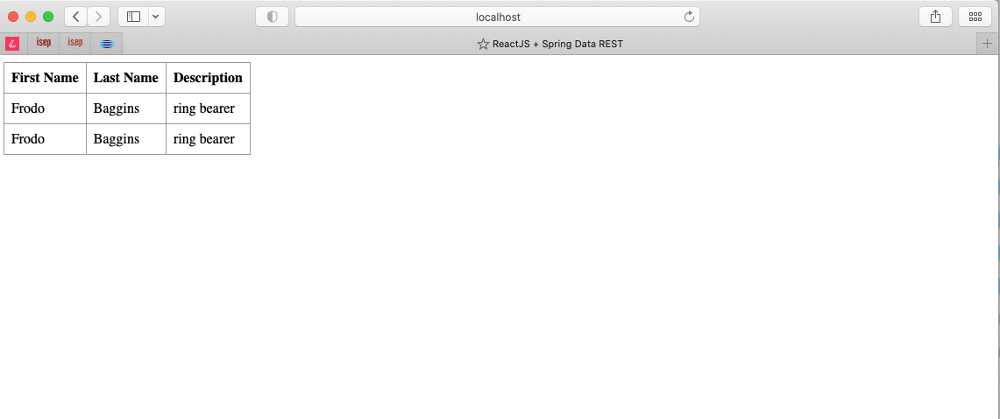
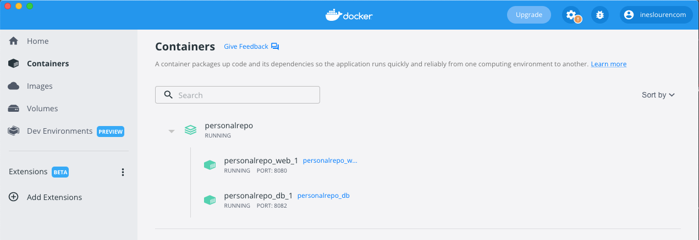
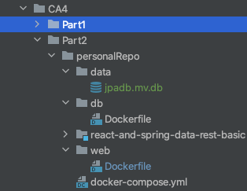

# Class Assignment 4

**Name:** Inês Lourenço Martins

**Discipline:** DEVOPS

**Date:** 9 May - 23 May

----------------------------------------------------------------------

### Description

This assignment has the purpose to manipulate diferent Containers with docker-compose up.

During this assignment and according to previous indications, the learning goals to attain are:

- First Week:
    - to practice with Docker, creating docker images and running containers using the chat application from CA2
- First Week:
   - to create a Dockerfile that can be able to start two containers with command Docker-compose up from CA3 
  
--- 

# Analysis, Design and Implementation - Part 2

## Analysis

Docker offers a semi-closed system level when creating a Container. Unlike Virtual Machines, that offers a closed system, having a Hypervisor that
completely separates the host OS from the guest OS, and this last one simulates a completely different system. Due to this premisse, a container, when installed, must 
match to the same kernel family as the host OS. For example, we cannot deploy a Windows related container in a Linux host OS.

Due to this factor, when installing Docker Desktop and since my OS is macOS - from the same family as Unix-based operating system - Docker Desktop app does run a Linux host Virtual Machine 
in my macOS. This becomes quite interesting, because we can never have the same configurations universally and everything relies on virtualization and 
containerization when developing software for different systems.

Another interesting feature is the container is running along as the process within it is alive. The container exits soon as the process
is complete

Similarly to last week assignment, we have to create containers to run our app. The difference is we must run two different images
in order to run our app:
   1. One for our database.
   2. Other for our web server, so tomcat can run. 

docker-compose up can enable the automatic run of these two containers, so let's see the steps in Implementation topic.

Just as last part of the assignment, the exercise is composed in two parts:

- Part 1 - build both images and respective containers and push the images to my personal repository in DockerHub

- Part 2 - use a volume with the db container to get a copy of the database file by using the
  exec to run a shell in the container and copying the database file to the volume.

### Usefull docker commands

List all running or not running containers

    docker ps -a

Stop a container:

    docker stop <container's name>

Remove a container:

    docker rm <container's name>

List all images:

    docker images

Remove an image (we must ensure that no container is running with that image!!):

    docker rmi <image-name>

Commit and push an image to our repository:

       docker commit [Container id] [docker hub use]/[Container name]:[Tag]
       docker push [docker hub user]/[Container name]:[Tag]

## Design

Part 1 

___

Part 2

## Implementation

 **First Part - Build two images and containers from Dockerfile**

1 .We need to create our Dockerfiles from the project we need . We've decided to copy the project to CA4 - Part 2 - personalRepo

###1. Build an image for our db
This file is retrieved from the Professor's repository, as suggested.

            FROM ubuntu

            RUN apt-get update && \
            apt-get install -y openjdk-8-jdk-headless && \
            apt-get install unzip -y && \
            apt-get install wget -y

            RUN mkdir -p /usr/src/app

            WORKDIR /usr/src/app/

            RUN wget https://repo1.maven.org/maven2/com/h2database/h2/1.4.200/h2-1.4.200.jar

            EXPOSE 8082
            EXPOSE 9092

            CMD java -cp ./h2-1.4.200.jar org.h2.tools.Server -web -webAllowOthers -tcp -tcpAllowOthers -ifNotExists

###2. Build an image for our web app.
This was the trickiest part, because we had to manage tomcat's version with java abd other 
dependecies (such as npm and nodejs)

Just as last week's assignment we must run the app in our port 8080. So, 
- we create the directory /tmp/build
- build our app from my personal repository
- copy the war file from the build
- deploy one copy of the war file in the tomcat
- delete the /tmp/build

         FROM tomcat:8-jdk8-temurin

         RUN apt-get update -y

         RUN apt-get install sudo nano git nodejs npm -f -y

         RUN apt-get clean && rm -rf /var/lib/apt/lists/*

         RUN mkdir -p /tmp/build

         WORKDIR /tmp/build/

         RUN git clone https://ineslourencom@bitbucket.org/ineslourencom/devops-21-22-atb-1211767.git

         WORKDIR /tmp/build/devops-21-22-atb-1211767/CA4/Part2/personalRepo/react-and-spring-data-rest-basic

         RUN ./gradlew clean build && ./gradlew war && cp build/libs/react-and-spring-data-rest-basic-0.0.1-SNAPSHOT.war /usr/local/tomcat/webapps/ && rm -Rf /tmp/build/

         EXPOSE 8080

###3. Create docker-compose.yml

It's from this document that we can manage both our images at the same time. 
In this file is estipulated the bridge network that will connect both containers

         version: '3'
            services:
               web:
                  build: web
                  ports:
                    - "8080:8080"
                  networks:
                  default:
                     ipv4_address: 192.168.56.10
                  depends_on:
                      - "db"
               
               db:
                  build: db
                  ports:
                    - "8082:8082"
                    - "9092:9092"
                  volumes:
                    - ./data:/usr/src/data-backup
                  networks:
                  default:
                     ipv4_address: 192.168.56.11
            networks:
               default:
                 ipam:
                  driver: default
                  config:
                    - subnet: 192.168.56.0/24

2. Now we can run the command to build in the directory that the file is present

          docker-compose build

3. And execute the docker-compose by running this command:

          docker-compose up

4. We can verify in the link:

http://localhost:8080/react-and-spring-data-rest-basic-0.0.1-SNAPSHOT/

5. Now we must push our images to our dockerHub

         docker login

Commit and push web:

         docker commit a9de2f475690 ineslourencom/personalrepo_web_1:v1
         
         docker push ineslourencom/personalrepo_web_1:v1

Commit and push db:

         docker commit 1e13d8609d15 ineslourencom/personalrepo_db_1:v1
         
         docker push ineslourencom/personalrepo_db_1:v1

**Second Part - Get a copy of the database file by using the
exec to run a shell in the container and copying the database file to the volume.**

To do this we must ensure both containers are running!

1. First, we're going to see the containers with the command

         docker ps -a

2. Execute a shell session inside the db container

         docker exec -it personalrepo_db_1 /bin/bash

3.Copy folder - jpad.mv.db and paste to our folder

         cp /usr/src/app/jpadb.mv.db /usr/src/data-backup

4. Exit from db shell

         exit

Now we can see the folder in personalRepo/data/ folder

---

# Alternative - Kubernets

## Definition

Kubernets is an open source platform that similar to Docker, also manages Container Development, allowing bundle and running applications without the need
of using a VM. Kubernets also orchestrates the containers: when one goes down, the software handles with another one. 
This allows scalability of systems, by reducing the network pressure and improve its efficiency 
(Do not confuse with System Orchestration, since it only handles containers). Kubernets is one of the most used technologys in
this field, besides Docker. It's advisable to use it in a cluster instead of a single use machine.

### Advantages

One of the main advantages already mentioned is the self-healing characteristics, creating another container when one fails;
Also, the possibility of implement containers in a single network of machines automates the whole process.
Kubernetes has a great workload portability, whch means that is not limited to the type of application.
Last but not least, Kubernets allows the monitoring the running envrionments, doing automatic health checkups on its services and comparing it 
to the desire state.

### Disadvantages
In fact, is a powerful open-source tool to container orchestration, but it also has its inconvenients. This complexity comes associated 
with overcomplexfication of small systems, which can lead to overkilling simple applications and systems. Also, its complexity is associated
to a must-have broaden knowledge of Kubernets. So, if it's to implement only one feature through Kubernets, might be easier to search for
an alternative.

#### Docker vs. Kubernetes

The main difference is its dimension in terms of applicability: Docker (simple version) performs tha packaging of containerized application on
a single node, while Kubernets is advised to implement across a cluster. 
Docker has a similar version on implementing containers to a cluster called Docker Swarm. So when comparing Docker Swarm and Kubernets,
they're quite similar, and they stand on an equal foot. A small detail is if running several workloads, need cloud-native interoperability 
and having several teams in your organization, requiring more isolation of services, Kubernetes is probably the platform to consider.
