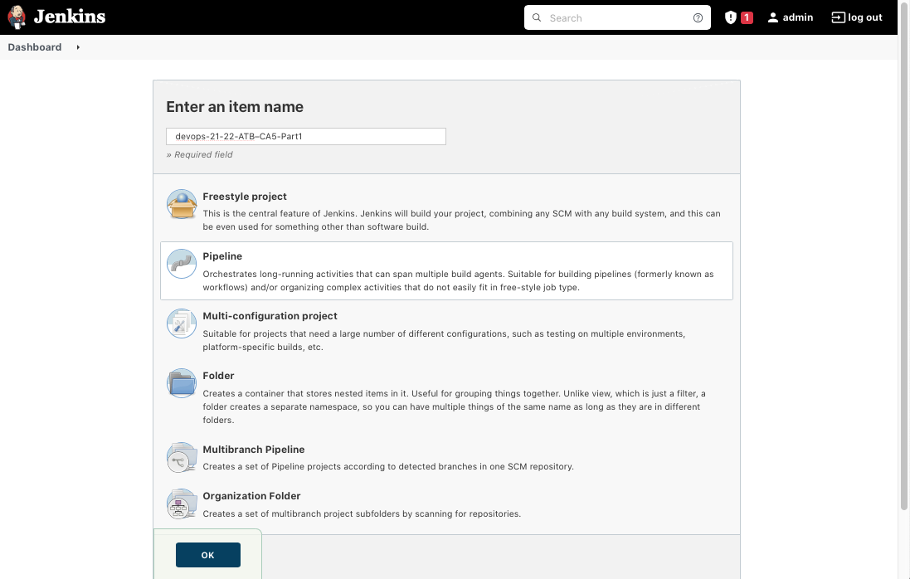

# Class Assignment 5

**Name:** Inês Lourenço Martins

**Discipline:** DEVOPS

**Date:** 23 May - 6 June

----------------------------------------------------------------------

### Description

This assignment has the purpose to manipulate CI/CD Pipelines with Jenkins.

During this assignment and according to previous indications, the learning goals to attain are:

- First Week:
    - to practice with Jenkins, by creating a simple pipeline from CA2 Part 1 (gradle basic demo)

  
--- 

# Analysis, Design and Implementation - Part 1

## Analysis

CI/CD configures a broader aspect in terms of what is DevOps, on which resulted the discipline and the main
topic of it. Jenkins gathers several tasks related to Continuous Development: for example, if someone submits code that cannot be build,
Jenkins notifies the team that the build is not complete. In a team, this is quite important and helps to fix quick and easily the error.
Another aspect of Jenkins is the nodes configurations: we can build several compilations environments on each one can have a 
set of singularities. 

A pipeline is the main core of Jenkins, basically are the configurations on how we compila a project. 
In the Jenkins platform is shown the build history, Pipeline phase and details.
Another aspect is the Pipeline syntax, that can either be Scripted or Declarative.

Some points related to Jenkins:
- The Job is the central aspect of the Pipeline. Node is the agent/computer that executes the pipeline. 
We can have several agents, but there is a main agent (parent) running behind all of them (usually the host environment).
- The stage incoporates the step on which is shown the part of the process.

We can either create directly a Pipeline Script or write the Jobs step by step.

After setting up the Jenkinsfile, Jenkins itself and BitBucket, the Pipeline is ready to run.

## Implementation

1.First, we needed to install Jenkins in our environment. Since it's a based java software, we can run it in two different ways, as 
suggested during the lecture. We've opted by downloading the jenkins.war file and execute it with the following command:

      java -jar jenkins.war

This enables our jenkins to run in our 8080 port. After this, we had to unlock Jenkins, set up with default suggested plugins and 
perform the login. We can always add as many plugins as we want in Jenkins settings.

2. Then we added the files from a forked repository that had the gradle_basic_demo project;

3. We've created a Jenkinsfile and added to our CA5 Part1 folder, and also we've set up the pipeline

4. Now we set up our Jenkinsfile according to our repository, redirecctionating to the proper folder on each stage

5. Now we have all running as it should.

