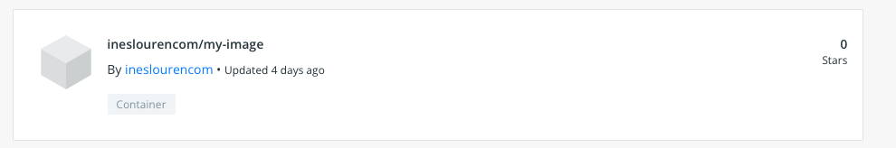
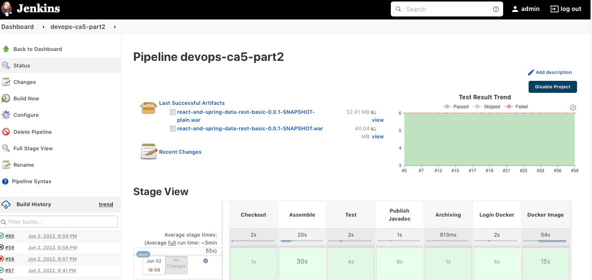
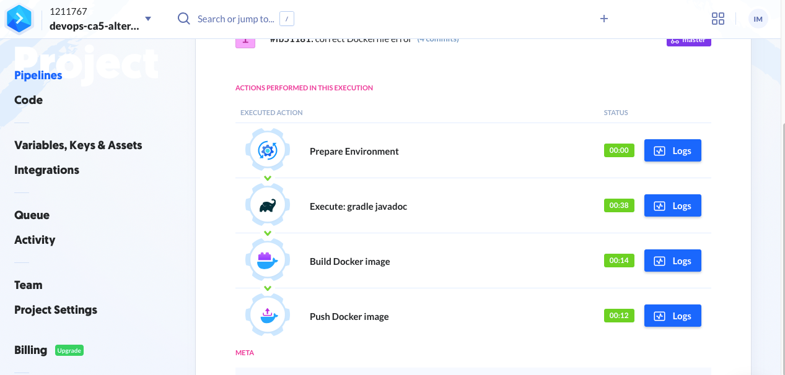
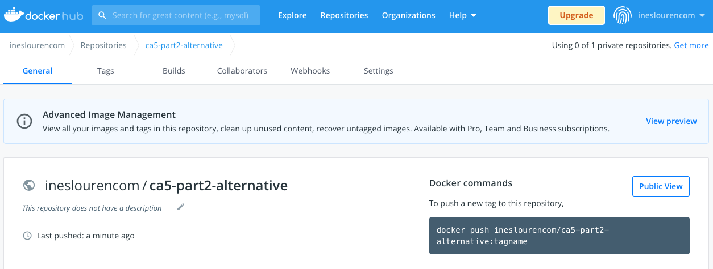

# Class Assignment 5

**Name:** Inês Lourenço Martins

**Discipline:** DEVOPS

**Date:** 30 May - 6 June

----------------------------------------------------------------------

### Description

This assignment has the purpose to manipulate CI/CD Pipelines with Jenkins and manipulate infrastructures with Ansible

During this assignment and according to previous indications, the learning goals to attain are:

- First Week:
    - to practice with Jenkins, by creating a simple pipeline from CA2 Part 1 (gradle basic demo)
- Second Week:
  - to practice with Jenkins, by creating a pipeline with new steps from CA2 Part 2 (react and spring data rest)
  
--- 

# Analysis, Design and Implementation - Part 2

## Analysis
CI/CD configures a broader aspect in terms of what is DevOps, on which resulted the discipline and the main
topic of it. Jenkins gathers several tasks related to Continuous Development: for example, if someone submits code that cannot be build,
Jenkins notifies the team that the build is not complete. In a team, this is quite important and helps to fix quick and easily the error.
Another aspect of Jenkins is the nodes configurations: we can build several compilations environments on each one can have a
set of singularities.

A pipeline is the main core of Jenkins, basically are the configurations on how we compila a project.
In the Jenkins platform is shown the build history, Pipeline phase and details.
Another aspect is the Pipeline syntax, that can either be Scripted or Declarative.

Some points related to Jenkins:
- The Job is the central aspect of the Pipeline. Node is the agent/computer that executes the pipeline.
  We can have several agents, but there is a main agent (parent) running behind all of them (usually the host environment).
- The stage incoporates the step on which is shown the part of the process.

We can either create directly a Pipeline Script or write the Jobs step by step.

After setting up the Jenkinsfile, Jenkins itself and BitBucket, the Pipeline is ready to run.

## Implementation
1. We access the previous to the Jenkins.war file that we had stored from Part 1, and we run the command:

       java -jar jenkins.war

This enables our jenkins to run in our 8080 port. After this, we had to unlock Jenkins, set up with default suggested plugins and
perform the login. We can always add as many plugins as we want in Jenkins settings.

2. We needed to update the Jenkinsfile or the PipelineScript in order to incorporate the two extra stages related to this week assignment.
To do that, we'll add:

         stage('Publish Javadoc'){
             steps{
                echo 'Creating Javadoc...'
                dir ("CA2/Part2/react-and-spring-data-rest-basic"){
                  sh './gradlew javadoc'
                  publishHTML([allowMissing: false,
                               alwaysLinkToLastBuild: true,
                               keepAll: true, reportDir: 'build/docs/javadoc',
                               reportFiles: 'index.html', reportName: 'HTML Report',
                               reportTitles: ''])
                }
             }
         }

and also:

         stage('Login Docker'){
                steps{
                sh 'echo $DOCKERHUB_CREDENTIALS_PSW | docker login -u $DOCKERHUB_CREDENTIALS_USR --password-stdin'
                }

        }
        stage ('Docker Image') {
            steps {
                script {
                    dir("CA5/Part2"){
                        def customImage = docker.build("ineslourencom/my-image:${env.BUILD_ID}")
                        customImage.push()
                    }
                }
            }
        }

These two steps allow us to have the Javadocs published and creating an image related to the Dockerfile present in CA5/Part2.

To do these tasks, we needed to add two important plugins: HTML Publisher and Docker Pipeline. There are quite a several plugins related to
Jenkins and what features we want to add.

3. After the build, we'll see the positive output and the published image:

___

##Alternative - Buddy

### Analysis
Buddy is a simple automation tool to introduce CI/CD, quite of simple use and specifically for developers, as they claim. 
The whole process is developed on browser (their website), we don't need to install or run anything in our local machine.
Buddy also works with automated Pipelines connected to a Version Control system (such as git): everytime that occurs a push,
the system updates and starts. Unlike Jenkins, Buddy doesn't need a .yaml file to describe the stages: we do it by selecting 
in their platform.

#### Buddy vs. Jenkins
We would say that Buddy is definetly an intuitive platform, that simplifies the process. It doens't need any plugin installation
and the setup for CI/CD is easier. 

### Implementation
1. We need to create an account in Buddy platform.
2. First we created a different repository only for CA2-Part2 with the respective Dockerfile. We've tried to import the whole devops-21-22-ATB–1211767 repository,
but Buddy couldn't find the Dockerfile needed to the last step.
3. We've created a project in Buddy
   1. COnfigure our new repository in Bitbucket
   2. Added the needed actions
      1. gradle
      2. docker create image
      3. docker push image
4. After it, we just need to create a commit and Buddy handles automatically the Pipeline

